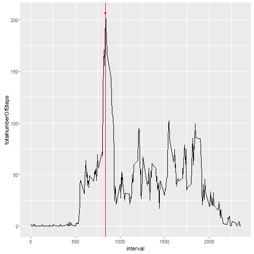
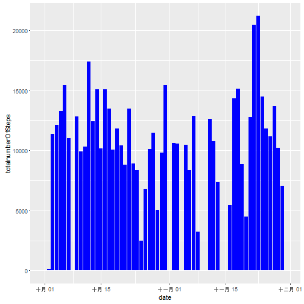
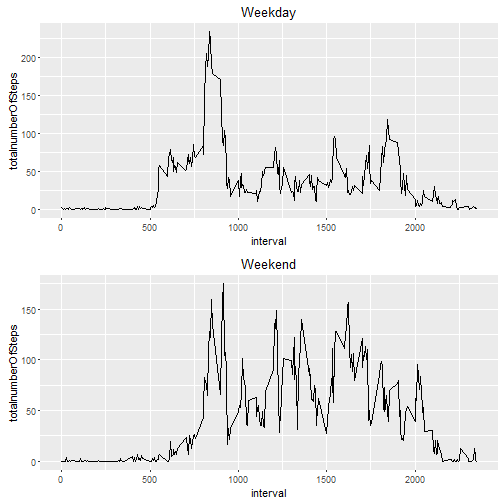

The Week 2 Assignment

Part 1: Loading and preprocessing the data


```r
library(dplyr)
```

```
## Warning: package 'dplyr' was built under R version 3.2.5
```

```
## 
## Attaching package: 'dplyr'
```

```
## The following objects are masked from 'package:stats':
## 
##     filter, lag
```

```
## The following objects are masked from 'package:base':
## 
##     intersect, setdiff, setequal, union
```

```r
library(ggplot2)
library(grid)

# read data from csv
#setwd("~/Documents/datascience/reproduciable/week2")
rawData <- read.csv("activity.csv", header = TRUE, sep=",")
```

Part 2: What is mean total number of steps taken per day?


```r
rawData2 <- mutate(rawData, date = as.Date(rawData$date, format = "%Y-%m-%d"))
groupby1<- group_by(rawData2, date)
totalNumSteps <- summarise(groupby1, totalnumberOfSteps=sum(steps, na.rm=TRUE))
ggplot(totalNumSteps, aes(date, totalnumberOfSteps)) + geom_bar(stat = "identity", fill = "blue")
```


```r
meanSteps <- mean(totalNumSteps$totalnumberOfSteps)
meanSteps
```

```
## [1] 9354.23
```

```r
medianSteps <- median(totalNumSteps$totalnumberOfSteps)
medianSteps
```

```
## [1] 10395
```

Part 3: What is the average daily activity pattern?


```r
groupby3<- group_by(rawData2, interval)
avgAP <- summarise(groupby3, totalnumberOfSteps=mean(steps, na.rm=TRUE))
maxnx <- subset(avgAP, avgAP[,2]==max(avgAP[,2]))[,1]
maxny <- subset(avgAP, avgAP[,2]==max(avgAP[,2]))[,2]
ggplot(avgAP, aes(interval, totalnumberOfSteps)) + geom_line(linetype=1) + geom_point(aes(x=maxnx, y=maxny), colour="red", stat="identity") + geom_vline(xintercept = as.numeric(maxnx), colour="red") 
```



Part 4: Imputing missing values


```r
# use mean for that day
data4 <- summarise(groupby1, meanDate=mean(steps, na.rm=TRUE))
missV1 <- is.na(rawData[,1])
length(missV1[missV1==TRUE])
```

```
## [1] 2304
```

```r
missV2 <- is.na(rawData[,2])
length(missV2[missV2==TRUE])
```

```
## [1] 0
```

```r
missV3 <- is.na(rawData[,3])
length(missV3[missV3==TRUE])
```

```
## [1] 0
```

```r
rawData4 <- rawData
for (i in 1:length(rawData4))  {
  if (is.na(rawData4[i,1])==TRUE) {

    tmp <- subset(data4, date==as.Date(rawData4[i,2], format = "%Y-%m-%d" ))
    rawData4[i,1] <- tmp[,1]
  }
}
groupby4<- group_by(rawData4, date)
totalNumSteps4 <- summarise(groupby1, totalnumberOfSteps=sum(steps, na.rm=TRUE))
ggplot(totalNumSteps4, aes(date, totalnumberOfSteps)) + geom_bar(stat = "identity", fill = "blue")
```



```r
meanSteps4 <- mean(totalNumSteps4$totalnumberOfSteps)
meanSteps4
```

```
## [1] 9354.23
```

```r
medianSteps4 <- median(totalNumSteps4$totalnumberOfSteps)
medianSteps4
```

```
## [1] 10395
```

Part 5: Are there differences in activity patterns between weekdays and weekends?


```r
rawData5 <- mutate(rawData, date = as.Date(rawData$date, format = "%Y-%m-%d"))
rawData5 <- mutate(rawData5, dayType="Weekday")
for (i in 1:nrow(rawData5))  {
  tmp <- rawData5[i,2]

  if (weekdays(tmp)=="ÐÇÆÚÁù") {
    rawData5[i,4] <- "Weekend"
  }
    if (weekdays(tmp)=="ÐÇÆÚÈÕ") {
    rawData5[i,4] <- "Weekend"
  }
}
rawDataWD5 <- filter(rawData5, dayType=="Weekday")
groupbyWD5<- group_by(rawDataWD5, interval)
dataWD5 <- summarise(groupbyWD5, totalnumberOfSteps=mean(steps, na.rm=TRUE))
rawDataWK5 <- filter(rawData5, dayType=="Weekend")
groupbyWK5<- group_by(rawDataWK5, interval)
dataWK5 <- summarise(groupbyWK5, totalnumberOfSteps=mean(steps, na.rm=TRUE))

g51 <- ggplot(dataWD5, aes(interval, totalnumberOfSteps)) + geom_line(linetype=1) + labs(title="Weekday")

g52 <- ggplot(dataWK5, aes(interval, totalnumberOfSteps)) + geom_line(linetype=1) + labs(title="Weekend")
vplayout <- function(x, y) viewport(layout.pos.row = x, layout.pos.col = y)
grid.newpage()
pushViewport(viewport(layout = grid.layout(2, 1)))
print(g51, vp = vplayout(1, 1))
print(g52, vp = vplayout(2, 1))
```




